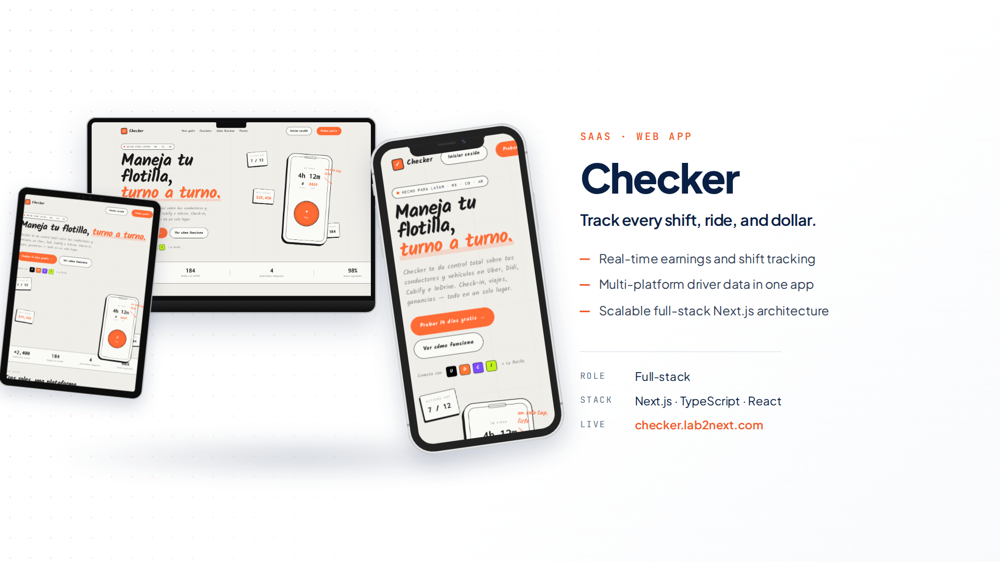
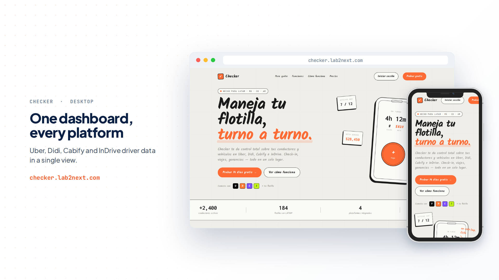
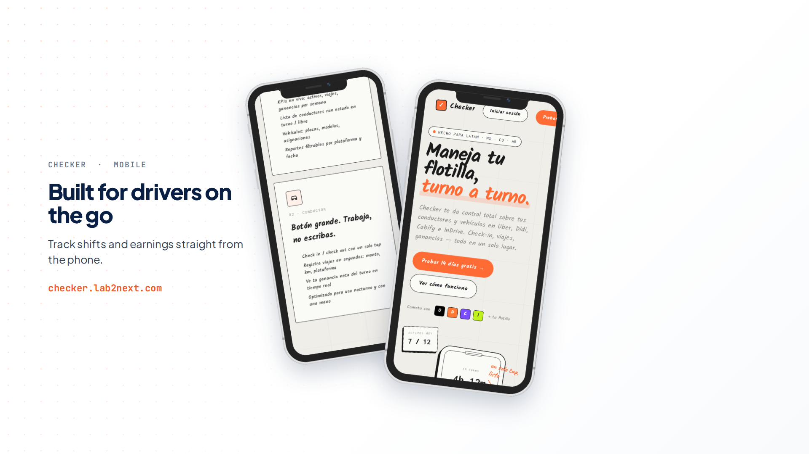
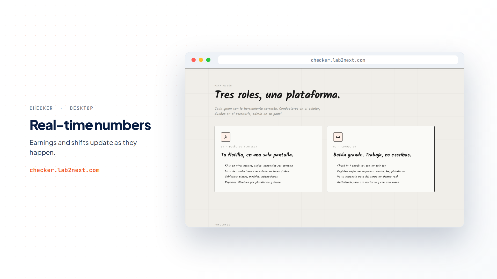
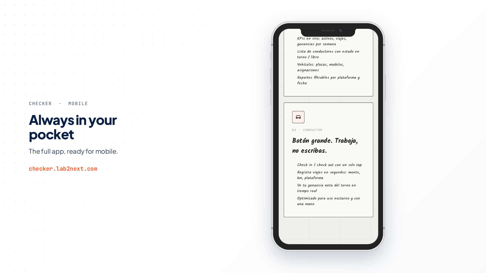

# Checker

Fleet management for ride-hailing drivers in LATAM. Live at [**checker.lab2next.com**](https://checker.lab2next.com).



## The idea

Fleet owners in LATAM (people who own a few cars and rent them to Uber, Didi, Cabify, and InDrive drivers) still run their business on WhatsApp messages and paper notebooks: who is on shift, how much each driver made, which car has which plates. I built Checker to put all of that in one place.

The design constraint that shaped the whole product: drivers use it at night, while working, with one hand. That is why check-in is a giant circular button and the driver view defaults to dark mode. The owner gets a desktop dashboard; the driver gets two taps and zero typing.

## What's inside

- **Two roles, two interfaces**: fleet owner dashboard (live KPIs, drivers on shift, vehicles, filterable reports) and a mobile-first driver view (check-in/check-out, trip logging in seconds, real-time net earnings per shift)
- **Multi-platform earnings**: Uber, Didi, Cabify, and InDrive in one dashboard, with gross vs net and automatic commission math
- **Vehicle management**: plates, models, assignments, one tap to reassign
- **Guided onboarding**: from account creation to first registered shift in about 10 minutes
- **Dark mode by default for drivers**, because most of this work happens at night

## A quick tour

| One dashboard, every platform | Built for drivers on the go |
| --- | --- |
|  |  |

| Real-time numbers | Always in your pocket |
| --- | --- |
|  |  |

## Stack

Next.js (App Router) · TypeScript · Tailwind CSS · shadcn/ui · pnpm

## Run it locally

```bash
pnpm install
pnpm dev
```

Copy `.env.example` to `.env.local` and fill in the values.

## Status

Functional MVP with a live demo. Built end to end (product, design, and code) as part of my habit of building SaaS for real LATAM problems, the same muscle behind [Lab2Next](https://lab2next.com).

---

Designed and built by [Javier Chi Ortiz](https://javierchiortiz.dev/en) in Mérida, México 🇲🇽
